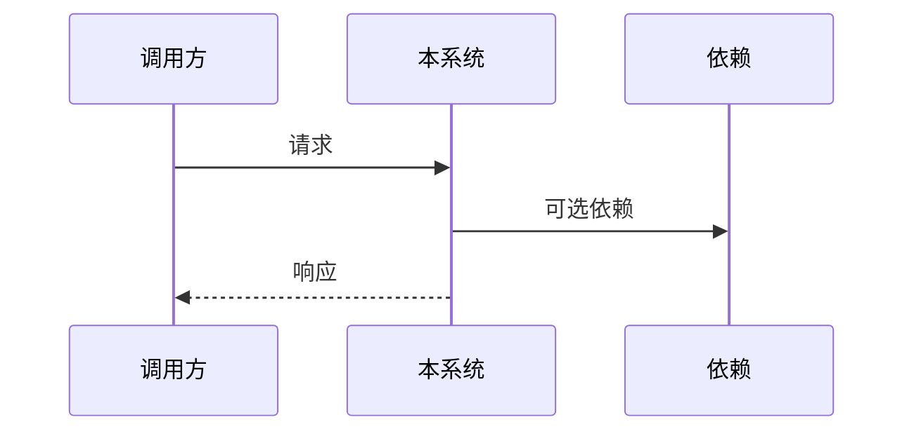

# 技术方案：{{title}}

**创建日期**：{{date}}
**存放路径**：`Plans/【客户端技术方案|服务端技术方案】/{{date}}-{{title}}.md`
**状态**：草稿 | 进行中 | 评审中 | 已采纳 | 搁置
**平台**：客户端（iOS/Android/Flutter） / 服务端（Go/Java/…）

---

## 一、背景与目标

- **业务需求/痛点**：【】
- **成功指标**：【可量化】
- **非目标**：【防过度设计】

---

## 二、AI 行为准则

1. 先输出模块划分 + 接口草案，再写实现细节。
2. UI/Handler 不写直连 DB；遵守 YAGNI。
3. 缺信息列「待确认」，不猜测。

---

## 三、原则对照（必遵守）

| 原则 | 要求 |
|------|------|
| SRP / OCP / DIP / ISP / LSP | 【按端勾选适用项】 |
| DRY / KISS / YAGNI | 【】 |

---

## 四、约束与前提

- **版本/环境**：【】
- **依赖服务**：【API、MQ、下游】
- **特性开关 / 灰度**：【】
- **合规**：【】

---

## 五、架构设计

### 客户端分层（platform=客户端 时）

Presentation → Domain → Data（Clean Arch + MVVM）

### 服务端分层（platform=服务端 时）

API → Application/Service → Domain → Infrastructure

### 模块边界

| 模块 | 职责 | 输入/输出 |
|------|------|-----------|
| 【】 | 【】 | 【】 |

### 关键流程



### 接口契约（服务端必填）

| 方法 | 路径 | 说明 | 幂等 |
|------|------|------|------|
| 【】 | 【】 | 【】 | 是/否 |

---

## 六、方案选项与决策矩阵

| 方案 | 性能 | 复杂度 | 成本 | 风险 | 备注 |
|------|------|--------|------|------|------|
| A | 【】 | 【】 | 【】 | 【】 | 【】 |
| B | 【】 | 【】 | 【】 | 【】 | 【】 |

**推荐**：【】 — 【理由】

---

## 七、上线与回滚

- **发布步骤**：【】
- **回滚触发**：【指标/开关】
- **回滚操作**：【】
- **数据迁移**：【有/无，脚本路径】

---

## 八、实施计划

| 阶段 | 内容 | 预估 |
|------|------|------|
| 1 | 【】 | 【】 |
| 2 | 【】 | 【】 |

---

## 九、验收标准

- [ ] 成功指标达标
- [ ] 分层无违规
- [ ] 特性开关可关闭
- [ ] 关键路径有测试
- [ ] 回滚方案已验证

---

## 续做

```
/resume plan=Plans/【分类】/{{date}}-{{title}}.md 进度=【】
```
