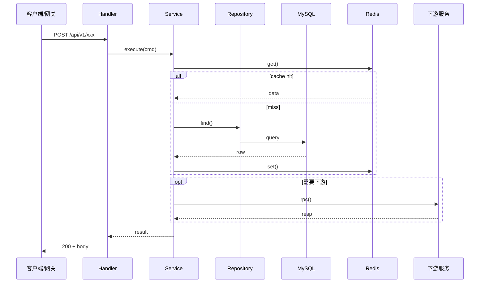

# 服务端技术方案：{{title}}

**创建日期**：{{date}}
**存放路径**：`Plans/服务端技术方案/{{date}}-{{title}}.md`
**状态**：草稿 | 评审中 | 已采纳
**技术栈**：Go / Java / Node.js / Python（标注语言与框架版本）
**负责人**：【】
**AI 角色**：辅助开发（接口实现、重构、单测、迁移脚本）

---

## 1. 背景与目标（明确「为什么」）

- **业务需求/痛点**：【流量增长、接口超时、数据不一致、运维成本】
- **成功指标**：【P99 < 200ms、可用性 99.9%、错误率 < 0.1%、支持 QPS 【】】
- **非目标**：【如不改造遗留模块 X、不上消息队列】

---

## 2. 软件工程原则（必须遵守）

| 原则 | 要求 | 示例 |
|------|------|------|
| **SRP** | 单一变更理由 | `OrderService` 不写 HTTP 解析 |
| **OCP** | 扩展优于修改 | 支付渠道用策略模式接入 |
| **DIP** | 依赖接口 | Service 依赖 `IOrderRepo` |
| **ISP** | 接口精简 | 读写 Repository 可拆分 |
| **DRY** | 避免重复 | 公共校验、错误码统一 |
| **KISS** | 简单直接 | 优先框架标准用法 |
| **YAGNI** | 不做超前设计 | 无需提前做多活 |
| **关注点分离** | 接口 / 业务 / 数据分层 | Handler 不写 SQL |
| **幂等性** | 写操作可安全重试 | 下单带 `idempotency_key` |
| **失败隔离** | 依赖降级 | 下游超时不拖垮线程池 |

> 关键模块注释标注原则与幂等/事务边界。

---

## 3. 约束与前提

- **运行时**：语言版本【】、部署环境（K8s/VM）【】
- **流量**：峰值 QPS【】、限流策略【】
- **数据**：MySQL/Redis/ES 版本；单表量级【】；是否分库分表
- **依赖**：上下游服务、超时、重试、熔断【】
- **安全**：鉴权（JWT/OAuth）、敏感数据脱敏、审计日志
- **合规**：数据留存、跨境、PII 处理【】
- **发布**：灰度、回滚、特性开关【】

---

## 4. 架构设计

### 4.1 分层（推荐）

```
[API]           → HTTP/gRPC Handler、参数校验、鉴权
[Application]   → Service / UseCase、事务编排、领域规则
[Domain]        → 实体、值对象、领域事件（可选）
[Infrastructure]→ Repository 实现、DB/Cache/MQ 客户端
```

- API 不直连 DB；业务逻辑不进 Handler
- 跨聚合事务明确边界（本地事务 vs 最终一致）

### 4.2 模块边界

| 模块 | 职责 | 输入/输出 | 原则 |
|------|------|-----------|------|
| 【Handler】 | 路由、校验、响应映射 | Request → DTO | SRP |
| 【Service】 | 业务编排 | Command → Result | DIP |
| 【Repository】 | 持久化 | Entity ↔ DB | ISP |
| 【Client】 | 调用下游 | RPC/HTTP | 失败隔离 |

### 4.3 关键流程



### 4.4 接口契约（摘要）

| 方法 | 路径 | 说明 | 幂等 |
|------|------|------|------|
| 【】 | 【】 | 【】 | 是/否 |

### 4.5 数据模型（摘要）

| 表/集合 | 核心字段 | 索引 | 备注 |
|---------|----------|------|------|
| 【】 | 【】 | 【】 | 【】 |

---

## 5. 方案选项与推荐

### 方案 A / B …

## 6. 推荐方案

- **选择**：【】
- **理由**：【】
- **风险与缓解**：【】

---

## 7. 实施计划

| 阶段 | 内容 | 预估 |
|------|------|------|
| 1 | 接口契约 + 数据模型评审 | 【】 |
| 2 | Repository + Service | 【】 |
| 3 | API + 集成下游 | 【】 |
| 4 | 单测/压测 + 灰度 | 【】 |

---

## 8. 验收标准

- [ ] 成功指标达标（延迟、错误率、QPS）
- [ ] 幂等 / 事务 / 降级策略已验证
- [ ] 监控告警（指标、日志、链路）已接入
- [ ] 回滚方案演练通过
- [ ] Code Review 通过

---

## 9. AI 输出要求

1. 先输出：分层划分 + 接口草案 + 表结构草案 + 原则对照。
2. Handler 薄、Service 承载业务；SQL 只在 Repository（或 ORM 层）。
3. 写操作必须说明幂等与事务范围；禁止为假想流量提前过度设计。
4. 缺信息列「待确认」；完成后提醒更新 plan + 决策存 `Contexts/`。

---

## 10. 相关决策

- `Contexts/【】`：【】

## 续做

```
/template-generator 任务类型=服务端方案，背景=...
@Skills/resume_assistant.md 续做，plan文件名=服务端技术方案/本文件名，当前进度=...
```
