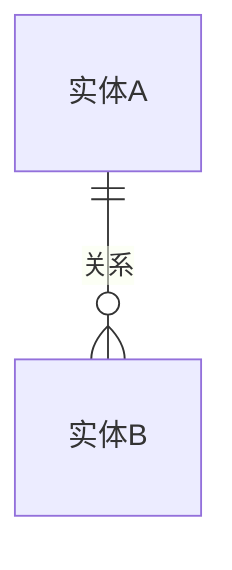
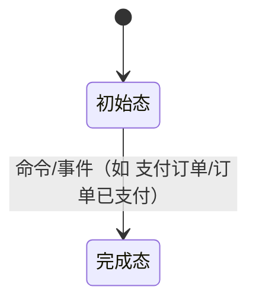
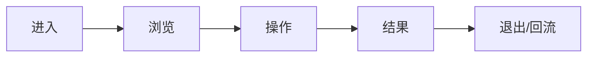

# 需求分析：{{title}}

**创建日期**：{{date}}  
**存放路径**：`Plans/需求分析/{{date}}-{{title}}.md`  
**状态**：草稿 | 进行中 | 评审中 | 已采纳 | 搁置 | pending-change  
**lifecycle_state**：requirement  
**真理源**：本文件为后续架构 / 开发 / 测试 / 部署的**唯一需求基准**；架构变动须先回看本文件。

> 基础分析仍遵循 [[Templates/需求分析模板]]；本模板**强制**补充边界、异常、验收标准。
> 方法论：先填战略层(Why)与范围层(What)对齐目标，再展开细节(How)。见 [[需求分析规范]]。
> **分卷**：人类卷三件套在前（≤3 页），`<!-- AI工作底稿 ↓ -->` 之后是 AI 推理底稿，规范见 [[Templates/模板约定]] §分卷规范。

---

# 人类卷（产品/开发 3 分钟读完即可开工）

## A. 用户使用地图

按「角色 → 场景 → 任务」列一张表，不画时序图。

| 角色 | 场景（什么时候） | 任务（要干什么） |
|------|------------------|------------------|
| 【】 | 【】 | 【】 |

## B. 关键业务时刻

把核心**业务事件**（过去式）按时间串成一条人话流程线，标人工介入点。

```text
用户进入 → 【事件1：已…】 →（可选：【事件2：已…】）→ 【事件3：已…】 → 完成
```

| 时刻（事件） | 谁触发 | 用户看到/得到什么 |
|--------------|--------|-------------------|
| 【已…】 | 【】 | 【】 |

## C. 关键业务规则（Do / Don't）

只讲「能不能」，不讲实现。

- **Do**：【】
- **Don't**：【】
- **前提 → 后果**：【如 移除专家 → 历史保留但不可再 @】

## D. 需求问题清单（产品必读 · 不确认无法开工）

> 把底稿 §六逻辑/§七交互/§八遗漏的问题**浓缩成产品视角一句话**，让没读底稿的产品也能直接拍板。三类标签：**🤔 不理解（语义不清）/ ⚔️ 矛盾（自相打架）/ 🕳️ 遗漏（该有没写）**。P0 不闭环禁止进架构/开发。

| # | 类 | 一句话问题 | 要产品拍板的 |
|---|----|-----------|-------------|
| P0-【】 | 🤔/⚔️/🕳️ | 【一句话，产品能听懂】 | 【要 TA 定的那个点】 |

---

<!-- AI工作底稿 ↓ -->

# AI 工作底稿（供 architecture / test 阶段消费，人类有疑问再翻）

## 〇、战略层（Why）

- **痛点**：【不做会怎样？现状有多痛？】
- **量化目标**：【如错误率 30%→1%、操作步骤 5→2】
- **用户故事**：作为【角色】，我想要【能力】，以便【价值】。

---

## 一、PRD 摘要（3–5 句）

【】

---

## 一·五、范围层（What）

| 包含功能 | 优先级 |
|----------|--------|
| 【】 | P0/P1 |

**明确不做**：【列出排除项，避免范围蔓延】

---

## 一·六、事件风暴 + 业务逻辑图（事件驱动，详见 [[需求分析规范]] §三）

> 先抓事件、再理逻辑、后画图。事件链是脊柱：状态机每条迁移必须挂一个事件。

**⓪ 事件风暴表（真相单元，先填这张）**

| 命令（动作） | 聚合 / 不变条件（业务规则） | 业务事件（过去式） |
|--------------|------------------------------|---------------------|
| 【提交…】 | 【聚合根 + 必须满足的规则】 | 【已…】 |

> 闭环自检：每个事件是否都有命令触发？每个命令是否都有结果事件？悬空项即遗漏。

**① 实体关系（ER 图）**



**② 状态机（核心聚合根生命周期 · 迁移必挂事件）**



**③ 主流程（泳道/时序）** ＋ **④ 用户路径决策图**：见 §八 用户旅程，或在此补 `sequenceDiagram` / `graph TD`。

---

## 二、范围与入口矩阵

| 入口/场景 | PRD 描述 | 触发条件 | 目标页面 |
|-----------|----------|----------|----------|
| 【】 | 【】 | 【】 | 【】 |

---

## 三、数据字典 / 字段规则

| 字段 | 类型 | 必填 | 长度/范围 | 默认值 | 来源 | 校验/激活 | 疑问 |
|------|------|------|-----------|--------|------|-----------|------|
| 【】 | 【】 | 【】 | 【】 | 【】 | 【】 | 【】 | 【】 |

---

## 四、边界情况清单（必填）

| # | 边界场景 | 期望行为 | PRD 是否写明 | 严重度 |
|---|----------|----------|--------------|--------|
| B1 | 空数据 / 首次使用 | 【】 | ☐ | P0/P1/P2 |
| B2 | 数据量极大 / 分页 | 【】 | ☐ | 【】 |
| B3 | 并发 / 重复提交 | 【】 | ☐ | 【】 |
| B4 | 权限不足 / 未登录 | 【】 | ☐ | 【】 |
| B5 | 网络超时 / 弱网 | 【】 | ☐ | 【】 |
| B6 | 依赖服务不可用 | 【】 | ☐ | 【】 |

---

## 五、异常流程矩阵（必填）

| 触发条件 | 用户可见反馈 | 系统行为 | 是否可恢复 | PRD 是否写明 |
|----------|--------------|----------|------------|--------------|
| 校验失败 | 【】 | 【】 | 是/否 | ☐ |
| 接口 4xx | 【】 | 【】 | 【】 | ☐ |
| 接口 5xx | 【】 | 【】 | 【】 | ☐ |
| 业务拒绝 | 【】 | 【】 | 【】 | ☐ |
| 操作中断 | 【】 | 【】 | 【】 | ☐ |

---

## 五·五、集成与人机协同边界

**外部交互点 + 异步/补偿**（事件链上的跨系统边界）

| 集成点 / 异步任务 | 类型 | 触发事件 | 失败/补偿策略 |
|-------------------|------|----------|---------------|
| 【支付/消息/AI模型/第三方】 | 同步API / 异步消息 / 定时任务 | 【已…】 | 【重试/补偿/人工】 |

**人机协同边界**（每个关键动作标注自动化程度）

| 动作 / 事件 | 全自动 | AI建议+人工确认 | 纯人工 |
|-------------|:------:|:---------------:|:------:|
| 【】 | ☐ | ☐ | ☐ |

---

## 六、逻辑问题

| # | 类型 | 问题 | PRD 摘录 | 严重度 |
|---|------|------|----------|--------|
| L1 | 【】 | 【】 | 【】 | P0/P1/P2 |

---

## 七、交互冲突

| # | 场景 A | 场景 B | 问题 | 建议问产品 |
|---|--------|--------|------|------------|
| I1 | 【】 | 【】 | 【】 | 【】 |

---

## 八、整体需求遗漏

### 用户旅程闭环



| 环节 | PRD 是否写明 | 若未写，缺什么 |
|------|--------------|----------------|
| 进入/退出 | ☐ | 【】 |
| 创建/编辑/删除 | ☐ | 【】 |
| 列表刷新 | ☐ | 【】 |

---

## 九、验收标准（必填，可测）

用 **Given-When-Then** 写关键场景，每条可测、无歧义，**Then 锚定一个业务事件已发生**，并补**反例**。

| # | 验收项 | 锚定事件 | Given（前置） | When（操作/命令） | Then（期望，含事件已发生） | 优先级 |
|---|--------|----------|---------------|-------------------|---------------------------|--------|
| AC1 | 【】 | 【已…】 | 【】 | 【】 | 【…且「已…」事件已发生】 | P0 |
| AC2 | 【】 | 【已…】 | 【】 | 【】 | 【】 | P1 |
| AC1-反 | 不触发场景 | — | 【】 | 【】 | 【不应发生该事件…】 | P0 |

**非功能验收**（可选）：性能 【】、兼容性 【】、安全 【】

---

## 十、待产品确认

**P0** · 【】  
**P1** · 【】  
**遗漏（P0）** · 【】

---

## 十一、分析结论

| 项 | 结论 |
|----|------|
| 可否进入架构设计 | ✅ / ⚠️ / ❌ |
| 关联架构 plan | [ ] `Plans/【客户端\|服务端】技术方案/{{date}}-{{title}}.md` |

---

## 续做

```
/resume plan=Plans/需求分析/{{date}}-{{title}}.md 进度=【】
```

**下一阶段 Skill**：`/architecture-design-assistant`，引用本 plan。
