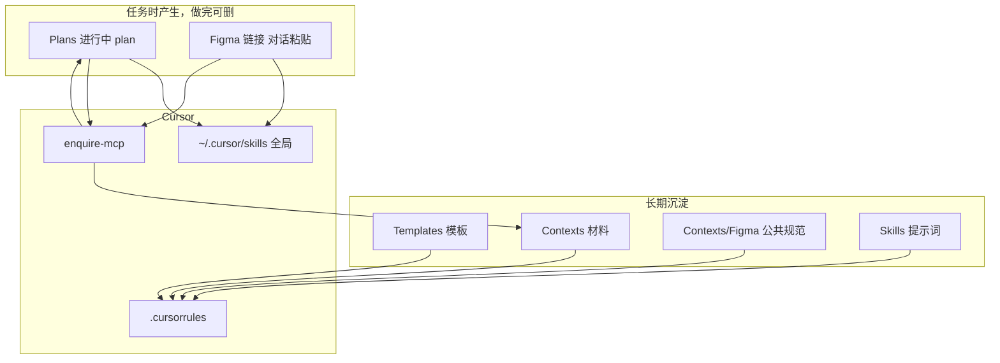

# AI-Work-Kit：个人知识库 × Cursor 协作方案

> **一句话**：Obsidian 沉淀**模板与规范**，Cursor 执行任务；进行中的 plan 和 Figma 链接**不长期存档**。

---

## 一、解决什么问题

| 痛点 | 做法 |
|------|------|
| 新会话重讲背景 | `/resume plan=Plans/... 进度=...` |
| 排查/方案/开发启动慢 | Templates + `/template-generator` |
| Figma 还原每次从零讲 | 客户端功能开发模板 + 公共规范；**链接任务时贴** |
| 材料用完就丢 | Contexts + enquire-mcp 语义搜索 |
| PM 对接物料反复整理 | `/material-prep` → `Contexts/` 对照表 |
| 不知 AI 何时有用 | 日报/周报 + 月度复盘 |

---

## 二、架构



### 工具分工

| 工具 | 角色 | 必要 |
|------|------|------|
| Obsidian | 编辑 Vault | ✅ |
| Cursor | AI 执行 | ✅ |
| `.cursorrules` | 常驻规则 | ✅ |
| `~/.cursor/skills/` | **任意项目**可用 `/skill` | 推荐 |
| `Skills/*.md` | Vault 内 `@` 引用 | 可选 |
| enquire-mcp | 按意思搜笔记 | 推荐（已验证） |

---

## 三、知识库结构

```
AI-Work-Kit/
├── Templates/              # 长期：排查、方案、功能开发、日报…
├── Contexts/
│   ├── Figma/              # 公共规范 + 最佳实践
│   ├── LLM学习/            # 学习路线、概念卡、笔记
│   ├── 日报/ 周报/ 会议/ 收银台/ …
│   └── MCP进阶指南.md
├── Skills/                 # 提示词笔记
├── Plans/                  # 临时：进行中任务
│   ├── Bug排查/
│   ├── 客户端技术方案/
│   ├── 服务端技术方案/
│   ├── 需求分析/
│   └── 功能开发/
├── .cursor/skills/
├── 索引.md                 # 入口
├── 分享包-快速开始.md
├── 分享方案-AI知识库与Cursor协作.md
└── 落地计划.md
```

> **顶层只放入口文档**；学习路线、MCP 指南、规范正文均在 `Contexts/`。

### 沉淀边界

| ✅ 分享 / 维护 | ❌ 不沉淀 |
|---------------|----------|
| Templates、[[Templates/模板约定]]、Skills | Figma URL |
| 会议/调研/决策、日报/周报、**PM 配置对照表** | 已上线功能索引 |
| 踩坑与复盘 | 做完的 plan |

---

## 四、Skill 一览

| Skill | 触发 | 用途 |
|-------|------|------|
| `template-generator` | `/template-generator` | 排查/方案/review/会议等开工 |
| `resume-assistant` | `/resume plan=... 进度=...` | 跨会话续做 |
| `requirement-analyst` | `/requirement-analyst` | PRD 分析 |
| `feature-dev-assistant` | `/feature-dev-assistant` | 功能开发（需求+方案+界面） |
| `figma-ui-assistant` | `/figma-ui-assistant` | 仅 UI |
| `review-assistant` | `/review-assistant 日报/周报` | 汇报与复盘 |
| `learn-assistant` | `/learn-assistant` | LLM 学习 |
| `material-prep-assistant` | `/material-prep` | PM 物料 / 配置对照表 → `Contexts/` |

Vault 内等价：`@Skills/xxx.md`

---

## 五、日常工作流

### 1. 排查 / 方案 / review

```
/template-generator 任务类型=排查，背景=现象+环境+日志
```

→ plan → `Plans/` → 执行 → 结论进 `Contexts/`

### 2. 需求 → 功能开发

```
/requirement-analyst → /feature-dev-assistant
```

→ plan 在 `Plans/需求分析/`、`Plans/功能开发/`

### 3. Figma 界面

```
/figma-ui-assistant 新任务，Figma=【粘贴】，平台=iOS，页面=xxx
```

→ plan 存 `Plans/功能开发/`（纯 UI 设含业务逻辑=否）

### 4. PM 资料 / 配置对照表

在业务代码仓库打开 Cursor（或指明参考仓库路径）：

```
/material-prep 类型=收银台，参考=Claw，新App=namiWork
```

→ 写入 `Contexts/{分类}/`（如 [[Contexts/收银台/MSPay收银台配置对照表]]）；**不写**业务项目 `docs/`

### 5. 续做

```
/resume plan=Plans/Bug排查/xxx.md 进度=已完成第1-2步
```

### 6. 存档 + 复盘

- 协作后 1 分钟 → `Contexts/`
- 每日/每周 → `/review-assistant 日报` / `周报`
- 月底 → [[Templates/月度复盘模板]]

---

## 六、给他人复现（30 分钟）

1. 复制整个 `AI-Work-Kit` 文件夹  
2. Obsidian + Cursor 打开同一目录  
3. 改 `.cursor/mcp.json` 的 `--vault` 路径 → Reload  
4. `cp -r .cursor/skills/* ~/.cursor/skills/`  
5. 验证：`/template-generator` 能响应；`/resume plan=...` 能续做

**只需改 1 处路径**：`.cursor/mcp.json` 里的 vault 绝对路径。

---

## 七、分享包清单

```
分享包/
├── AI-Work-Kit/
│   ├── Templates/、Skills/、Contexts/
│   ├── .cursor/、.cursorrules
│   ├── 索引.md、分享包-快速开始.md、分享方案、落地计划
│   └── README.md
└── （可选）快速开始.pdf
```

**不要打包**：`workspace.json`、敏感 Contexts、个人 plan、Figma 链接

---

## 八、团队推广（四阶段）

| 阶段 | 动作 |
|------|------|
| 0 个人验证 | 3 个真实任务 + 1 组续做耗时数据 |
| 1 试点 | 2–3 人，只分享模板+规范+Skill |
| 2 标准化 | 统一 [[Templates/模板约定]]、标签 |
| 3 汇报 | 一页摘要 + 续做案例 + 踩坑清单 |

---

## 九、成功指标

| 指标 | 1 月 | 2 月 |
|------|------|------|
| 续做成功率 | ≥ 80% | ≥ 90% |
| 启动时间 | ≤ 3 min | ≤ 2 min |
| 模板覆盖率 | 50% | ≥ 80% |
| 材料复用 | ≥ 3/周 | ≥ 5/周 |

---

## 十、FAQ

**Q：一定要 MCP？**  
A：不必须；详见 [[Contexts/MCP进阶指南]]。

**Q：为什么在别的项目 `@` 不到 Skill？**  
A：`@` 只索引当前工作区；用 `/template-generator` 等全局 Skill。

**Q：学习从哪开始？**  
A：[[Contexts/LLM学习/学习路线-LLM与提示词]]，第一课是 LLM+提示词，不是 MCP。

**Q：plan 要永久保留吗？**  
A：不必须；进行中用，做完删或只留结论到 Contexts。

**Q：资料库写在哪？PM 物料怎么沉淀？**  
A：资料库 = 本 Vault 的 `Contexts/`。用 `/material-prep` 或 `@Skills/material_prep_assistant.md`；示例 [[Contexts/收银台/MSPay收银台配置对照表]]。不要默认写到业务代码仓库的 `docs/`。

---

## 十一、汇报一页摘要

> **主题**：AI 协作知识库实践  
> **工具**：Obsidian + Cursor + enquire-mcp  
> **方法**：模板快启 · `/resume` 续做 · Contexts 复用  
> **成果**：续做节省 __ min/次 · 模板 __ 次/月 · 复用 __ 次/周  
> **结论**：适合 __ / 谨慎 __  
> **下一步**：__  

---

**关联**：[[索引]] · [[分享包-快速开始]] · [[Contexts/MCP进阶指南]] · [[落地计划]] · [[Skills/README]] · [[Templates/模板约定]]
