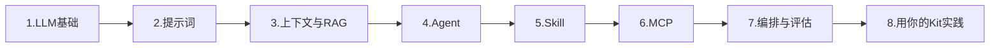

# 学习路线：LLM · 提示词 · Agent · Skill · MCP

> 用 AI-Work-Kit **同一套方法**学和工作：模板开工 → plan 续学 → Contexts 沉淀概念。

## ⭐ 从这里开始（不要跳课）

**第一课**：[[Plans/学习/2026-06-12-第1课-LLM与提示词入门]]

```
/learn-assistant 新主题，题目=LLM基础与提示词入门，目标=能解释token和上下文窗口，并写出结构化prompt
```

| 阶段 | 主题 | 何时学 |
|------|------|--------|
| **1** | LLM 基础 + 提示词 | **现在** |
| 2 | 上下文管理 | 第 1 课完成后 |
| 3 | RAG（思想，先不碰配置） | 第 2 课后 |
| 4 | Agent | 会写 prompt 之后 |
| 5 | Skill | 理解 Agent 之后 |
| **6** | MCP | **最后几课** — 你 Kit 里 enquire 已装好，学到再用 |
| 7 | 评估与安全 | 有实践后再看 |
| 8 | Kit 综合实践 | 串起来 |

> MCP 是「插头」，不是起点。先会写 prompt、懂上下文，再学 Agent/Skill，最后才接 MCP。

## 和工作流的对应关系

| 工作 | 学习 |
|------|------|
| `Templates/排查问题模板` | `Templates/学习笔记模板` |
| `Plans/Bug排查/` 进行中任务 | `Plans/学习/` 正在学的主题 |
| `Contexts/` 决策与调研 | `Contexts/LLM学习/` 概念卡与对比 |
| `/resume-assistant` 续做 | `/learn-assistant` 续学 |
| `/review-assistant` 月底复盘 | 学习周复盘 + 费曼检验 |

---

## 推荐学习顺序（8 周可伸缩）



| 周 | 主题 | 学完能回答 | 沉淀位置 |
|----|------|------------|----------|
| 1 | [[Contexts/LLM学习/概念/大语言模型]] | Token、温度、上下文窗口是什么？ | 概念卡 |
| 2 | [[Contexts/LLM学习/概念/提示词工程]] | 好 prompt 的结构？System/User 分工？ | 概念卡 + 自写 3 个 prompt |
| 3 | RAG / 上下文 | RAG 和「把全文塞进 prompt」区别？ | `Contexts/LLM学习/概念/RAG` |
| 4 | [[Contexts/LLM学习/概念/Agent]] | Agent 和「一次问答」区别？工具调用流程？ | 概念卡 |
| 5 | [[Contexts/LLM学习/概念/Skill]] | Cursor Skill vs Obsidian 笔记 Skill？ | 对照你自己的 [[Skills/README]] |
| 6 | [[Contexts/LLM学习/概念/MCP]] | MCP 解决什么问题？ | 对照 [[MCP进阶指南]] + 亲手调 enquire |
| 7 | 评估与安全 | 幻觉、越狱、评测怎么做？ | 踩坑笔记 `#学习/踩坑` |
| 8 | 综合实践 | 用 Kit 完成一次「学→练→沉淀」闭环 | `Plans/学习/` 案例 |

---

## 概念地图（按需深入）

| 概念 | 一句话 | 笔记 |
|------|--------|------|
| LLM | 预测下一个 token 的大模型 | [[Contexts/LLM学习/概念/大语言模型]] |
| Prompt | 给模型的输入与指令 | [[Contexts/LLM学习/概念/提示词工程]] |
| Context Window | 模型一次能「看见」的长度 | 见 LLM 概念卡 |
| RAG | 先检索再生成，补知识库 | [[Contexts/LLM学习/概念/RAG]] |
| Agent | 能规划、调工具、多步执行的 AI | [[Contexts/LLM学习/概念/Agent]] |
| Tool / Function Calling | Agent 调外部能力的方式 | 见 Agent 概念卡 |
| Skill | 可复用的任务指令包 | [[Contexts/LLM学习/概念/Skill]] |
| MCP | AI 与外部系统的标准「接头」 | [[Contexts/LLM学习/概念/MCP]] |
| Rules / .cursorrules | 常驻系统级约束 | 见 Skill 概念卡 |
| 工作流 | 模板 + plan + 续做 + 复盘 | [[分享包-快速开始]] |

---

## 每天 / 每周怎么用

### 开一个新主题（5 分钟）

```
/learn-assistant 新主题，题目=LLM基础与提示词，目标=能写结构化prompt并解释token，资料=知识库概念卡
```

### 学了一节后（10 分钟）

Obsidian：`Insert template → 学习笔记模板` → 存 `Contexts/LLM学习/笔记/`

或：

```
/learn-assistant 整理笔记，主题=今天学的RAG，要点=【粘贴草稿】
```

### 隔天续学

```
/learn-assistant 续学，plan=学习/2026-06-12-第1课-LLM与提示词入门.md，进度=已读完LLM概念卡，还没写3个prompt
```

### 周末检验（费曼）

```
/learn-assistant 考我，范围=本周学的 Agent 和 Skill，形式=追问+让我用 AI-Work-Kit 举例
```

### 和工作的连接

学到 MCP → 打开 [[MCP进阶指南]] 对照你的 enquire 配置；学到 Skill → 读 `Skills/resume_assistant.md` 当样例。

---

## 资料放哪

| 类型 | 放哪 | 说明 |
|------|------|------|
| 概念定义、对比表 | `Contexts/LLM学习/概念/` | 长期，越写越厚 |
| 某本书/课的笔记 | `Contexts/LLM学习/笔记/` | 按 `YYYY-MM-DD-主题` |
| 正在学的计划 | `Plans/学习/` | 做完可归档或删 |
| 外链教程 | **对话里贴**或笔记里临时记 | 不强制进索引 |
| 好 prompt 范例 | `Contexts/LLM学习/范例/` | 自己写的可复用 prompt |

---

## 标签

`#学习` `#学习/概念` `#学习/笔记` `#学习/踩坑` `#LLM` `#prompt` `#agent` `#mcp` `#skill`

---

## 下一步

1. 打开 [[Plans/学习/2026-06-12-第1课-LLM与提示词入门]] 按步骤做  
2. 可选：[[Contexts/LLM学习/知识地图]] 扫一眼全貌（不用全懂）  
3. 学完用 [[Templates/学习笔记模板]] 沉淀  
4. **不要**先开 MCP — 那是 [[Plans/学习/示例-第6周-MCP入门]]
